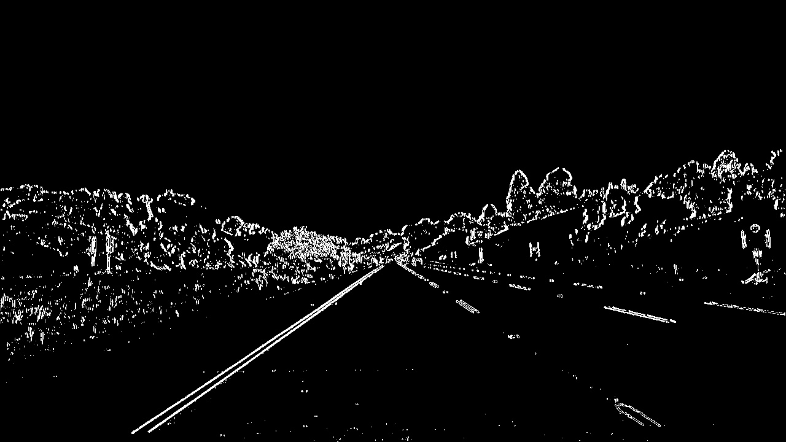
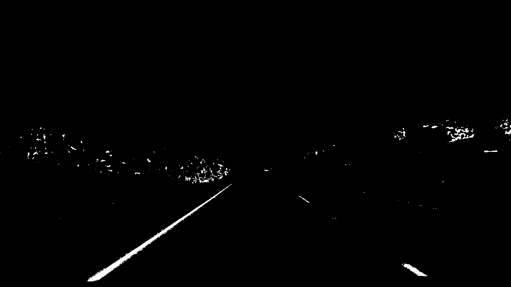
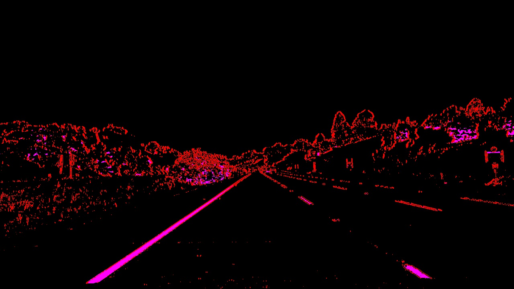
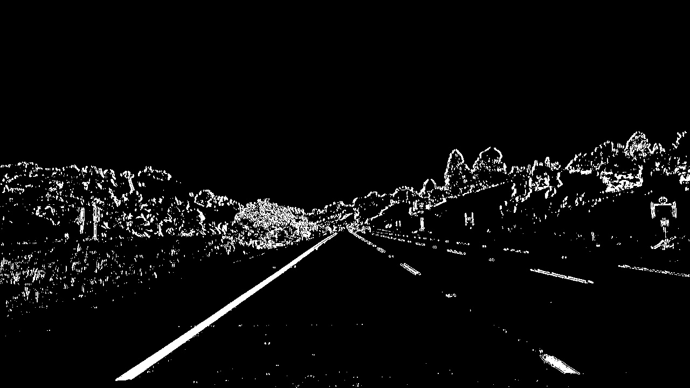
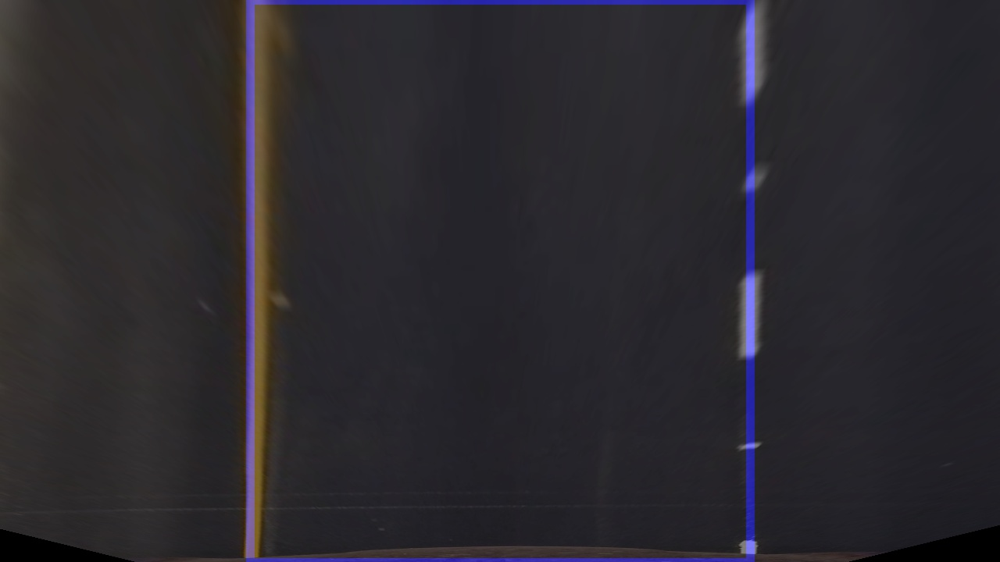
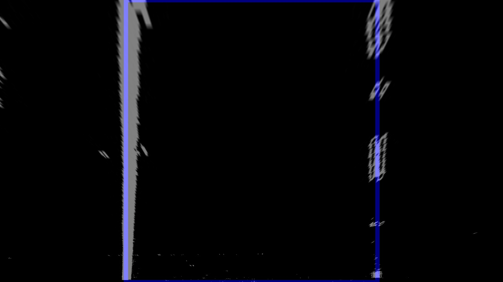
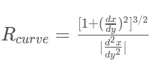
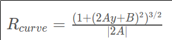
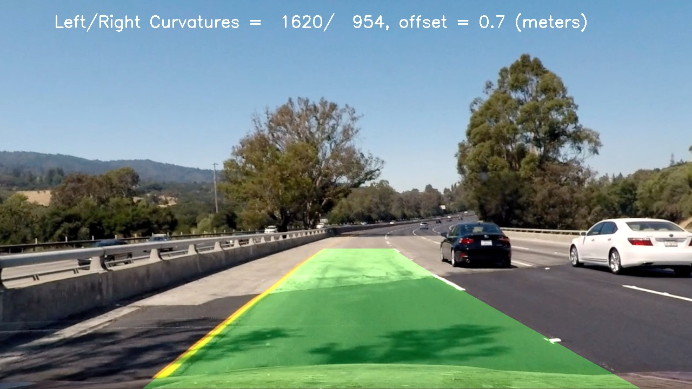
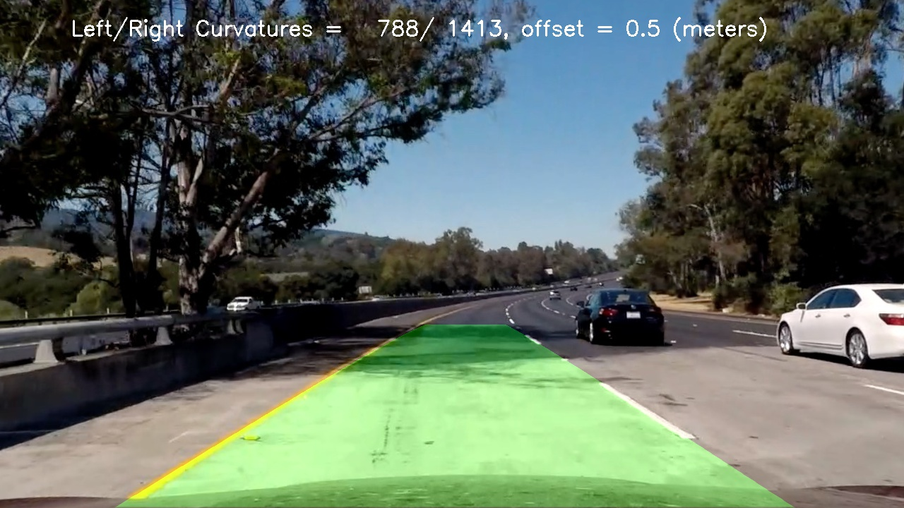

# Advanced Lane Finding Projects

The notes for this project are best viewed on line at the
[repo](https://github.com/carltonwin8/CarND-Advanced-Lane-Lines)
or at the
[documentation](https://github.com/carltonwin8/CarND-Advanced-Lane-Lines).
because the source code is linked to by this document and the more
detailed documentation/comments/notes can be seen there.
This project is my completion of the Udacity project template provided at
[this](https://github.com/udacity/CarND-Advanced-Lane-Lines)
repository.

The project code was developed using the
[spyder IDE](https://pythonhosted.org/spyder/)
and is maded up of the following files.

  - [lane_line.py](http://carltonwin8.github.io/CarND-Advanced-Lane-Lines/_modules/lane_line.html) -
    The main lane line identification procedures.
  - [files.py](http://carltonwin8.github.io/CarND-Advanced-Lane-Lines/_modules/files.html) -
    Script used to generate the pictures for this document.
  - [screen.py](http://carltonwin8.github.io/CarND-Advanced-Lane-Lines/_modules/screen.html) -
    Script used during the development and debug phase.
  - [utils.py](http://carltonwin8.github.io/CarND-Advanced-Lane-Lines/_modules/utils.html) -
    Utility procedures that are not part of the main lane line identification procedures.


The steps of this project are the following:

* Compute the camera calibration matrix and distortion coefficients given a set of chessboard images.
* Apply a distortion correction to raw images.
* Use color transforms, gradients, etc., to create a thresholded binary image.
* Apply a perspective transform to rectify binary image ("birds-eye view").
* Detect lane pixels and fit to find the lane boundary.
* Determine the curvature of the lane and vehicle position with respect to center.
* Warp the detected lane boundaries back onto the original image.
* Output visual display of the lane boundaries and numerical estimation of lane curvature and vehicle position.

## Camera Calibration

I start by preparing "object points", which will be the (x, y, z) coordinates of
the chessboard corners in the world. Here I am assuming the chessboard is fixed
on the (x, y) plane at z=0, such that the object points are the same for each
calibration image. Thus, `objp` is just a replicated array of coordinates, and
`objpoints` will be appended with a copy of it every time I successfully detect
all chessboard corners in a test image. `imgpoints` will be appended with the
(x, y) pixel position of each of the corners in the image plane with each
successful chessboard detection.

I then used the output `objpoints` and `imgpoints` to compute the camera
calibration and distortion coefficients using the `cv2.calibrateCamera()`
function.
The code for these operations is in the
[calibrateCamera](http://carltonwin8.github.io/CarND-Advanced-Lane-Lines/_modules/lane_line.html#calibrate)
function.

I applied this distortion correction to the test image using the
`cv2.undistort()` function and obtained these result:
The code for this operation is in the
[undistort](http://carltonwin8.github.io/CarND-Advanced-Lane-Lines/_modules/lane_line.html#undistort)
function.
The following images shows the test results.

| Original Image | Undistorted Image | Original Image | Undistorted Image
|:---:|:---:|:---:|:---:|
|  |  |  |  |

## Edge Detect

I used the sobel X gradient thresholds _anded_ with the HLS color space S
channel threshold to generate a binary image.
The code for these operation is in the
[sobel_x_binary](http://carltonwin8.github.io/CarND-Advanced-Lane-Lines/_modules/lane_line.html#sobel_x_binary),
[hls_s_binary](http://carltonwin8.github.io/CarND-Advanced-Lane-Lines/_modules/lane_line.html#hls_s_binary),
[combine_binary](http://carltonwin8.github.io/CarND-Advanced-Lane-Lines/_modules/lane_line.html#combine_binary) and
[edge_detect](http://carltonwin8.github.io/CarND-Advanced-Lane-Lines/_modules/lane_line.html#edge_detect)
functions.
The following images shows the intermediate results from these steps.

| sobel x | hls s | x or'ed s color | x or'ed s
|:---:|:---:|:---:|:---:|
|  |  |  |  |

## Perspective Transform

The code for this operation is in the
[perspective_transform_values](http://carltonwin8.github.io/CarND-Advanced-Lane-Lines/_modules/lane_line.html#perspective_transform_values),
[perspective_transform_map](http://carltonwin8.github.io/CarND-Advanced-Lane-Lines/_modules/lane_line.html#hperspective_transform_map) and
[perspective_transform](http://carltonwin8.github.io/CarND-Advanced-Lane-Lines/_modules/lane_line.html#perspective_transform)
functions.
The `cv2.getPerspectiveTransform()` function creates a transform from the
source (`src`) and destination (`dst`) points noted below.
The values shown below were optimized on the first test image using the
[files-transform](http://carltonwin8.github.io/CarND-Advanced-Lane-Lines/_modules/files.html#transform) and
[utils-perspective_transform](http://carltonwin8.github.io/CarND-Advanced-Lane-Lines/_modules/utils.html#perspective_transform)
utilities:
```python
src = np.float32(
    [[(img_size[0] / 2) - 60, img_size[1] / 2 + 100],
    [((img_size[0] / 6) - 10), img_size[1]],
    [(img_size[0] * 5 / 6) + 40, img_size[1]],
    [(img_size[0] / 2 + 60), img_size[1] / 2 + 100]])
dst = np.float32(
    [[(img_size[0] / 4), 0],
    [(img_size[0] / 4), img_size[1]],
    [(img_size[0] * 3 / 4), img_size[1]],
    [(img_size[0] * 3 / 4), 0]])

```
This resulted in the following source and destination points:

| Source        | Destination   |
|:-------------:|:-------------:|
| 580, 460      | 320, 0        |
| 203, 720      | 320, 720      |
| 1106, 720     | 960, 720      |
| 700, 460      | 960, 0        |

The transform was tested on the images noted below to verify that the lines appear parallel in the warped image.

| not transformed | transformed | sobel x OR'ed hls s
|:---:|:---:|:---:|
|  |  |  |

## Identify Lane Lines
#### 4. Describe how (and identify where in your code) you identified lane-line pixels and fit their positions with a polynomial?

After the perspective transform the lane lines were identified by the
[fit_poly](http://carltonwin8.github.io/CarND-Advanced-Lane-Lines/_modules/line_line.html#fit_poly) and
[fit_poly_noslide](http://carltonwin8.github.io/CarND-Advanced-Lane-Lines/_modules/line_line.html#fit_poly_noslide)
functions.
One first frame detection
[fit_poly](http://carltonwin8.github.io/CarND-Advanced-Lane-Lines/_modules/line_line.html#fit_poly)
was used and all following frames
[fit_poly_noslide](http://carltonwin8.github.io/CarND-Advanced-Lane-Lines/_modules/line_line.html#fit_poly_noslide).

The following steps were completed to determine the polynomial.

<table>
<tr><td>Step</td><td>Description</td></tr>
<tr><td>1</td><td>
the total number of non zero pixels were summed in the bottom half of the image,
which provided a pixel count along the x axis
</td></tr>
<tr><td>2</td><td>
the starting searching location for left and right lane was selected base on the
above pixel count being the highest
</td>3</tr>
the image was sliced horizontally into 9 parts, each being 80 pixels tall
</td></tr>
</table>

## Radius of curvature and vehicle position

Once the polynomial is fitted, as describe in the above section,
the radius of curvature is calculated using the
`curve of poly` formula below.

| 2nd order poly | curvature of point | curve of poly |
|:---:|:---:|:---:|
|  |  |  |

The variables `left_curverad` and `right_curverad` in function
[get_poly](http://carltonwin8.github.io/CarND-Advanced-Lane-Lines/_modules/line_line.html#get_poly)
shows the calculation of the radius of curvature based on the above equation.

The `offset` variable in the
[find_lane_lines.ffl](http://carltonwin8.github.io/CarND-Advanced-Lane-Lines/_modules/line_line.html#find_lane_lines.ffl)
function show the calucation for the position of the vehicle.

## Lane Line Plot

I implemented this step in
[poly2image](http://carltonwin8.github.io/CarND-Advanced-Lane-Lines/_modules/line_line.html#poly2image)
function and examples output follows.

| test4.jpg | test5.jpg |
|:---:|:---:|
|  |  |

### Pipeline (video)

Here's a [link to my video result](https://youtu.be/QwIH1pBiFEM)

I you want to generate the video yourself run the following command from in the `src` directory.
```
./process_video.py 7 -c 1
```

### Discussion

The approach/steps I took to develop the project was to:
  - complete the code necessary to generate the images required for this documentation
  - create a pipeline of the above code to process the video and generate the output file
  - found the problematic parts in the video output
    - created smaller videos with the problematic sections
    - looped a large number of threshold values on the problematic sections
    - identified the optimal threshold values

The code could be improved as follows.
  - Allow for different image size.
  - Allow for tuning of the polynomial fitting procedure so that you can change the windows size,
      number of windows, margins and the minimum number of pixels required to determine the window position.

I am submitting the code at its present state in order to get feedback
before I got to far off the beaten path.

The submitted code could be improved and made more robust by implementing:
 - sanity checking
 - look-ahead filter
 - reset based on the sanity checking and
 - smoothing
