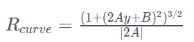

# Advanced Lane Finding Projects

The notes for this project are best viewed on line at the
[github repo](https://github.com/carltonwin8/CarND-Advanced-Lane-Lines).
It is easier to follow the link to the source code referenced in this documentation.
This readme is my completion of the Udacity project template provided at
[this repo](https://github.com/udacity/CarND-Advanced-Lane-Lines).

The project code is developed using the
[spyder IDE](https://pythonhosted.org/spyder/)
and is made up of the following files.

  - [lane_line.py](http://carltonwin8.github.io/CarND-Advanced-Lane-Lines/_modules/lane_line.html) -
    The main lane line identification procedures.
  - [process_video.py](http://carltonwin8.github.io/CarND-Advanced-Lane-Lines/_modules/process_video.html) -
    The main routine used to process various videos while varying some parameters.
  - [files.py](http://carltonwin8.github.io/CarND-Advanced-Lane-Lines/_modules/files.html) -
    Script used to generate the images seen in this document.
  - [screen.py](http://carltonwin8.github.io/CarND-Advanced-Lane-Lines/_modules/screen.html) -
    Script used during the development and debug phase for visualization.
  - [utils.py](http://carltonwin8.github.io/CarND-Advanced-Lane-Lines/_modules/utils.html),
    [config.py](http://carltonwin8.github.io/CarND-Advanced-Lane-Lines/_modules/config.html) and
    [display.py](http://carltonwin8.github.io/CarND-Advanced-Lane-Lines/_modules/display.html) -
    Utility procedures and setup information.


The steps of this project are the following:

* Compute the camera calibration matrix and distortion coefficients given a set of chessboard images.
* Apply a distortion correction to raw images.
* Use color transforms, gradients, etc., to create a thresholded binary image.
* Apply a perspective transform to rectify binary image ("birds-eye view").
* Detect lane pixels and fit to find the lane boundary.
* Determine the curvature of the lane and vehicle position with respect to center.
* Warp the detected lane boundaries back onto the original image.
* Output visual display of the lane boundaries and numerical estimation of lane curvature and vehicle position.

## Camera Calibration

In the
[calibrateCamera](http://carltonwin8.github.io/CarND-Advanced-Lane-Lines/_modules/lane_line.html#calibrate)
function
I start by preparing "object points", which will be the (x, y, z) coordinates of
the chessboard corners in the world. Here I am assuming the chessboard is fixed
on the (x, y) plane at z=0, such that the object points are the same for each
calibration image. Thus, `objp` is just a replicated array of coordinates, and
`objpoints` will be appended with a copy of it every time I successfully detect
all chessboard corners in a test image. `imgpoints` will be appended with the
(x, y) pixel position of each of the corners in the image plane with each
successful chessboard detection.


I applied this distortion correction to the test image using
`cv2.undistort()` in the
[undistort](http://carltonwin8.github.io/CarND-Advanced-Lane-Lines/_modules/lane_line.html#undistort)
function and obtained the following results.

| Original Image | Undistorted Image | Original Image | Undistorted Image
|:---:|:---:|:---:|:---:|
|  |  |  |  |

## Edge Detect

I used the sobel X gradient thresholds **anded** with the HLS color space S
channel threshold to generate a binary image.
The code for these operation is in the
[sobel_x_binary](http://carltonwin8.github.io/CarND-Advanced-Lane-Lines/_modules/lane_line.html#sobel_x_binary),
[hls_s_binary](http://carltonwin8.github.io/CarND-Advanced-Lane-Lines/_modules/lane_line.html#hls_s_binary),
[combine_binary](http://carltonwin8.github.io/CarND-Advanced-Lane-Lines/_modules/lane_line.html#combine_binary),
[threshold](http://carltonwin8.github.io/CarND-Advanced-Lane-Lines/_modules/lane_line.html#threshold) and
functions.
The following images shows the intermediate results from these steps.

| sobel x | hls s | x or'ed s color | x or'ed s
|:---:|:---:|:---:|:---:|
|  |  |  |  |

## Perspective Transform

The code for this operation is in the
[perspective_transform_values](http://carltonwin8.github.io/CarND-Advanced-Lane-Lines/_modules/lane_line.html#perspective_transform_values),
[perspective_transform_map](http://carltonwin8.github.io/CarND-Advanced-Lane-Lines/_modules/lane_line.html#perspective_transform_map) and
[perspective_transform](http://carltonwin8.github.io/CarND-Advanced-Lane-Lines/_modules/lane_line.html#perspective_transform)
functions.
The `cv2.getPerspectiveTransform()` function creates a transform from the
source (`src`) and destination (`dst`) points noted below.
The values shown below were optimized on the first test image using the
[files-transform](http://carltonwin8.github.io/CarND-Advanced-Lane-Lines/_modules/files.html#transform) and
[utils-perspective_transform](http://carltonwin8.github.io/CarND-Advanced-Lane-Lines/_modules/utils.html#perspective_transform)
utilities:
```python
src = np.float32(
    [[(img_size[0] / 2) - 60, img_size[1] / 2 + 100],
    [((img_size[0] / 6) - 10), img_size[1]],
    [(img_size[0] * 5 / 6) + 40, img_size[1]],
    [(img_size[0] / 2 + 60), img_size[1] / 2 + 100]])
dst = np.float32(
    [[(img_size[0] / 4), 0],
    [(img_size[0] / 4), img_size[1]],
    [(img_size[0] * 3 / 4), img_size[1]],
    [(img_size[0] * 3 / 4), 0]])

```
This resulted in the following source and destination points:

| Source        | Destination   |
|:-------------:|:-------------:|
| 580, 460      | 320, 0        |
| 203, 720      | 320, 720      |
| 1106, 720     | 960, 720      |
| 700, 460      | 960, 0        |

The transform was tested on the images noted below to verify that the lines appear parallel in the warped image.

| not transformed | transformed | sobel x OR'ed hls s
|:---:|:---:|:---:|
|  |  |  |

## Identify Lane Lines And Polynomial Fitting

After the perspective transform the lane lines were identified by the
[fit_poly](http://carltonwin8.github.io/CarND-Advanced-Lane-Lines/_modules/lane_line.html#fit_poly),
[get_poly](http://carltonwin8.github.io/CarND-Advanced-Lane-Lines/_modules/lane_line.html#get_poly) and
[fit_poly_noslide](http://carltonwin8.github.io/CarND-Advanced-Lane-Lines/_modules/lane_line.html#fit_poly_noslide)
functions.
The first frame is detected by the
[fit_poly](http://carltonwin8.github.io/CarND-Advanced-Lane-Lines/_modules/lane_line.html#fit_poly)
function and all following frames were identified by the
[fit_poly_noslide](http://carltonwin8.github.io/CarND-Advanced-Lane-Lines/_modules/lane_line.html#fit_poly_noslide)
function.

The following steps were completed to determine the polynomial.

<table>
<tr><th>Step</th><th>Description</th></tr>
<tr><td>1</td><td>
In the
<a href="http://carltonwin8.github.io/CarND-Advanced-Lane-Lines/_modules/lane_line.html#fit_poly">fit_poly</a> <!--_-->
function the total number of non zero pixels were summed in the bottom half of
the image, which provided a pixel count along the x axis.
</td></tr>
<tr><td>2</td><td>
The center locations for the left and right lanes were selected base on the
above pixel count being the highest.
</td></tr>
<tr><td>3</td><td>
The image was sliced horizontally into 9 windows, each being 80 pixels tall.
</td></tr>
<tr><td>4</td><td>
The lane line pixels for the first slice are calculated by using the
center location determined in <em>Step 2</em> and then looking to the left and right of that
center location by a margin and saving the non zero pixels. These non zero
pixels were used to determine a new center location used by the next step.
</td></tr>
<tr><td>5</td><td>
The lane line pixels for the following slices are calculated by using the
center location determined in <em>Step 4</em> and then looking to the left and right of that
center location by a margin and saving the non zero pixels. These non zero
pixels are used to determine a new center location which will be used for the
line detection in the following windows.
</td></tr>
<tr><td>6</td><td>
The
<a href="http://carltonwin8.github.io/CarND-Advanced-Lane-Lines/_modules/lane_line.html#get_poly">get_poly</a> <!--_-->
function then takes the lane pixels and and fits a second order polynomial to
the data. This function returns the polynomial in both
pixels and meters and also the radius of curvature. The calculation details of
the radius of curvature are provided in the section below.
</td></tr>
<tr><td>7</td><td>
The
<a href="http://carltonwin8.github.io/CarND-Advanced-Lane-Lines/_modules/lane_line.html#fit_poly_noslide">fit_poly_noslide</a> <!--_-->
function is used on a frame once a polynomial is determined for the previous frame.
The search for the lane center does not need to be done because this is
determined by the polynomial of the previous frame.
</td></tr>
</table>

## Radius Of Curvature And Vehicle Position

Once the polynomial is fitted, as describe in the above section,
the radius of curvature is calculated using the
`curve of poly` formula below.

| 2nd order poly | curvature of point | curve of poly |
|:---:|:---:|:---:|
|  |  |  |

The variables `left_curverad` and `right_curverad` in the function
[get_poly](http://carltonwin8.github.io/CarND-Advanced-Lane-Lines/_modules/lane_line.html#get_poly)
shows the calculation of the radius of curvature based on the above equation.

The `offset` variable in the
[find_lane_lines.fll](http://carltonwin8.github.io/CarND-Advanced-Lane-Lines/_modules/lane_line.html#find_lane_lines.fll)
function shows the calculation for the position of the vehicle.

## Lane Line Plot

I implemented this step in the
[poly2image](http://carltonwin8.github.io/CarND-Advanced-Lane-Lines/_modules/lane_line.html#poly2image)
function and example outputs follow.

| test4.jpg | test5.jpg |
|:---:|:---:|
|  |  |

## Video Pipeline

Here's a [link to my video result](https://youtu.be/QwIH1pBiFEM)
which shows no catastrophic failures.

If you want to generate the video yourself, run the following command from in the `src` directory.
```
./process_video.py 7 -c 1
```
Details of the pipeline can be seen in
[process_video.py](http://carltonwin8.github.io/CarND-Advanced-Lane-Lines/_modules/process_video.html).

### Discussion

The approach/steps I took to develop the project was to:
  - complete the code necessary to generate the images required for this documentation
  - create a pipeline of the above code to process the video and generate the output file
  - found the problematic parts in the video output
    - created smaller videos with the problematic sections
    - looped through a large number of threshold values on the problematic sections
    - identified the optimal threshold values

The code could be improved as follows.
  - Allow for different image sizes.
  - Allow for tuning of the polynomial fitting procedure so that you can change the windows size,
      number of windows, margins and the minimum number of pixels required to determine the window position.
  - Complete the convolution curve fitting algorithm that was partially coded in the
    [find_windows_centroids](http://carltonwin8.github.io/CarND-Advanced-Lane-Lines/_modules/lane_line.html#find_window_centroids)
    function but was not finally used.


From the video the lane detection does not appear to have any fatal lane detections
but the submitted code could be improved and made more robust by implementing:
 - sanity checking
 - look-ahead filter
 - reset based on the sanity checking and
 - smoothing
