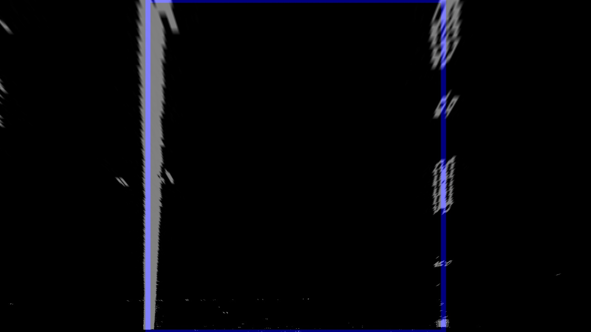

# Advanced Lane Finding Projects

The notes for this project are best viewed on line at the
[repo](https://github.com/carltonwin8/CarND-Advanced-Lane-Lines)
or at the
[documentation](https://github.com/carltonwin8/CarND-Advanced-Lane-Lines).
because the source code is linked to by this document and the more
detailed documentation/comments/notes can be seen there.
This project is my completion of the Udacity project template provided at
[this](https://github.com/udacity/CarND-Advanced-Lane-Lines)
repository.

The project code was developed using the
[spyder IDE](https://pythonhosted.org/spyder/)
and is maded up of the following files.

  - [lane_line.py](_modules/lane_line.html) -
    The main lane line identification procedures.
  - [files.py](_modules/files.html) -
    Script used to generate the pictures for this document.
  - [screen.py](_modules/screen.html) -
    Script used during the development and debug phase.
  - [utils.py](_modules/utils.html) -
    Utility procedures that are not part of the main lane line identification procedures.


The steps of this project are the following:

* Compute the camera calibration matrix and distortion coefficients given a set of chessboard images.
* Apply a distortion correction to raw images.
* Use color transforms, gradients, etc., to create a thresholded binary image.
* Apply a perspective transform to rectify binary image ("birds-eye view").
* Detect lane pixels and fit to find the lane boundary.
* Determine the curvature of the lane and vehicle position with respect to center.
* Warp the detected lane boundaries back onto the original image.
* Output visual display of the lane boundaries and numerical estimation of lane curvature and vehicle position.

## Camera Calibration

I start by preparing "object points", which will be the (x, y, z) coordinates of
the chessboard corners in the world. Here I am assuming the chessboard is fixed
on the (x, y) plane at z=0, such that the object points are the same for each
calibration image. Thus, `objp` is just a replicated array of coordinates, and
`objpoints` will be appended with a copy of it every time I successfully detect
all chessboard corners in a test image. `imgpoints` will be appended with the
(x, y) pixel position of each of the corners in the image plane with each
successful chessboard detection.

I then used the output `objpoints` and `imgpoints` to compute the camera
calibration and distortion coefficients using the `cv2.calibrateCamera()`
function.
The code for these operations is in the
[calibrateCamera](_modules/lane_line.html#calibrate)
function.

I applied this distortion correction to the test image using the
`cv2.undistort()` function and obtained these result:
The code for this operation is in the
[undistort](_modules/lane_line.html#undistort)
function.
The following images shows the test results.

| Original Image | Undistorted Image | Original Image | Undistorted Image
|:---:|:---:|:---:|:---:|
|  |  |  |  |

## Edge Detect

I used the sobel X gradient thresholds _anded_ with the HLS color space S
channel threshold to generate a binary image.
The code for these operation is in the
[sobel_x_binary](_modules/lane_line.html#sobel_x_binary),
[hls_s_binary](_modules/lane_line.html#hls_s_binary),
[combine_binary](_modules/lane_line.html#combine_binary) and
[edge_detect](_modules/lane_line.html#edge_detect)
functions.
The following images shows the intermediate results from these steps.

| sobel x | hls s | x or'ed s color | x or'ed s
|:---:|:---:|:---:|:---:|
|  |  |  |  |

## Perspective Transform

The code for this operation is in the
[perspective_transform_values](_modules/lane_line.html#perspective_transform_values),
[perspective_transform_map](_modules/lane_line.html#hperspective_transform_map) and
[perspective_transform](_modules/lane_line.html#perspective_transform)
functions.
The `cv2.getPerspectiveTransform()` function creates a transform from the
source (`src`) and destination (`dst`) points noted below.
The values shown below were optimized on the first test image using the
[files-transform](_modules/files.html#transform) and
[utils-perspective_transform](_modules/utils.html#perspective_transform)
utilities:
```python
src = np.float32(
    [[(img_size[0] / 2) - 60, img_size[1] / 2 + 100],
    [((img_size[0] / 6) - 10), img_size[1]],
    [(img_size[0] * 5 / 6) + 40, img_size[1]],
    [(img_size[0] / 2 + 60), img_size[1] / 2 + 100]])
dst = np.float32(
    [[(img_size[0] / 4), 0],
    [(img_size[0] / 4), img_size[1]],
    [(img_size[0] * 3 / 4), img_size[1]],
    [(img_size[0] * 3 / 4), 0]])

```
This resulted in the following source and destination points:

| Source        | Destination   |
|:-------------:|:-------------:|
| 580, 460      | 320, 0        |
| 203, 720      | 320, 720      |
| 1106, 720     | 960, 720      |
| 700, 460      | 960, 0        |

The transform was tested on the images noted below to verify that the lines appear parallel in the warped image.

| not transformed | transformed | sobel x OR'ed hls s
|:---:|:---:|:---:|
|  |  |  |

## Identify Lane Lines
#### 4. Describe how (and identify where in your code) you identified lane-line pixels and fit their positions with a polynomial?

Then I did some other stuff and fit my lane lines with a 2nd order polynomial kinda like this:

![alt text][image5]

## Radius of curvature

#### 5. Describe how (and identify where in your code) you calculated the radius of curvature of the lane and the position of the vehicle with respect to center.

I did this in lines # through # in my code in `my_other_file.py`

## Lane Line Plot

 of curvature
#### 6. Provide an example image of your result plotted back down onto the road such that the lane area is identified clearly.

I implemented this step in lines # through # in my code in `yet_another_file.py` in the function `map_lane()`.  Here is an example of my result on a test image:

![alt text][image6]

---

### Pipeline (video)

#### 1. Provide a link to your final video output.  Your pipeline should perform reasonably well on the entire project video (wobbly lines are ok but no catastrophic failures that would cause the car to drive off the road!).

Here's a [link to my video result](./project_video.mp4)

---

### Discussion

#### 1. Briefly discuss any problems / issues you faced in your implementation of this project.  Where will your pipeline likely fail?  What could you do to make it more robust?

Here I'll talk about the approach I took, what techniques I used, what worked
and why, where the pipeline might fail and how I might improve it if I were
going to pursue this project further.  

#### Issues

  - straight_lines1 show that the provided transformation coefficients did not produce
    a straight line. To produce a straigh line the coefficients were changed from
    (), (), (), () to (), (), (), ().
  - test5 image had too much of noise from the shadows and the HLS minimum threshold was
    tuned from the provided 150 up to 180.
  - test4 image the curve in the road was too large and the sliding windows was not
    large enough. The value of 100 was increased so that I correctly predicted the
    road curve.

#### Future Enhancements

  - Change hard coded values noted below to setup parameters so code can be tuned and generalized.

    - Allow for different image sized.
    - Allow for tuning of threshold values
    - Allow for tuning of the polynomial fitting procedure so that you can change the windows size,
      number of windows, margins and the minimum number of pixels required to determine the window position.
